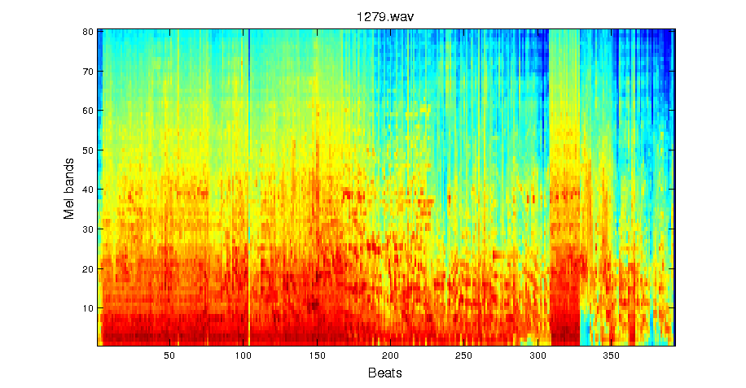
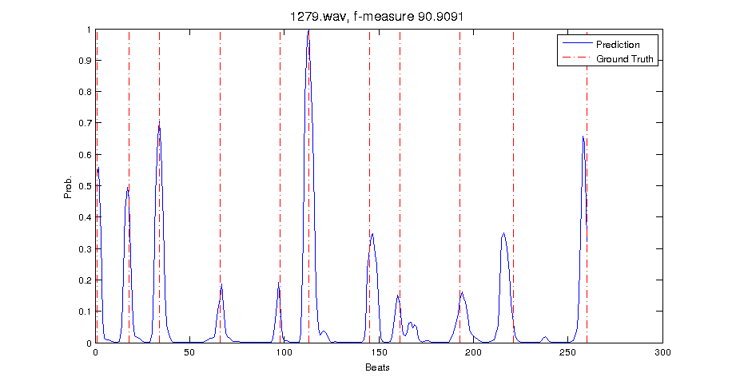

## Segmentation CNN

### Method
Convolutional neural networks (CNN) for music segmentation. Similar than in [1], a log-scaled Mel spectrogram is extracted from the audio signal, with the difference that input spectrograms are max pooled across beat times. Beat tracking was done using the [MADMOM toolbox](https://github.com/CPJKU/madmom) with the DBN beat tracking algorithm from [2]. Context windows of 16 bars are then classified by a CNN to determine whether the central beat is a segment boundary. The CNN training was implemented using [Keras](http://keras.io/).

On the 'Internet Archive' portion of the [SALAMI](http://ddmal.music.mcgill.ca/research/salami/annotations) dataset it achieves a boundary detection f-Measure of 59% at a tolerance of 2 beats for a random 0.9/0.1 split. Some audio files did not have a corresponding annotation and were discarded.

An example of a beat-wise log Mel spectrogram

and corresponding prediction with ground truth segment annotations.


Some more example outputs of the CNN with corresponding ground truth annotations can be found in the 'Results' subfolder (the nicer ones :)

### Downloading the SALAMI data

1. Clone the repository public [SALAMI data repository](https://github.com/DDMAL/salami-data-public) and put it in the `./Data` folder as a subdirectory.
2. Run the script provided [here](https://github.com/DDMAL/SALAMI/blob/master/SALAMI_download.py) (requiring Python 2):

```bash
mkdir Audio
cd ./Python
python2 SALAMI_download.py ../Data/salami-data-public/metadata/id_index_internetarchive.csv ../Audio/
```

### Running the beat detection

In order to open MP3 files provided by the SALAMI dataset, the `ffmpeg` library is needed on Debian/Ubuntu. It can be installed via

```
sudo apt install ffmpeg
```

After that the beat tracking from the MADMOM library can be run on all files with

```bash
cd ./Audio
DBNBeatTracker batch -o ./ $(ls *.mp3)
```

This will take quite some time and use a lot of memory. After finishing, the beat files  (`*.beats.txt`) will be placed next to the audio files.

### Model training and prediction

After the beat times are extracted, the model can be trained by calling the feature extraction and training scripts:

```bash
cd ./Python
python3 feature_extraction.py
python3 train_segmentation_cnn.py
```

The trained model will be saved in the data directory and can be used to predict segments for an unseen audio file:

```bash
python3 track_segmentation.py AUDIO_FILE
```

### TODO
This is work in progress! So far the evaluation is run in MATLAB, whereas for the CNN training, the Keras Python library was used. Evaluation is done on the beat level using the beat-level labels constructed from the ground truth annoations. For computing the f-Measure, the [Beat Tracking Evaluation Toolbox](https://code.soundsoftware.ac.uk/projects/beat-evaluation/) was used. Currently porting the feature extraction and evaluation to Python.

### Requirements

For the CNN training:

* [Keras](http://keras.io/) version 2.4.3

Feature extraction in Python:
* [Madmom](https://github.com/CPJKU/madmom)
* [librosa](https://github.com/librosa/librosa)
* Numpy, Scipy

Evaluation:
* [mir_eval](https://github.com/craffel/mir_eval)
* [peakutils](https://pypi.python.org/pypi/PeakUtils)
* Matplotlib


### References

[1] Karen Ullrich, Jan Schlüter and Thomas Grill: Boundary detection in music structure analysis using convolutional neural networks. ISMIR 2014. [pdf](http://www.ofai.at/~jan.schlueter/pubs/2014_ismir.pdf)

[2] Sebastian Böck, Florian Krebs and Gerhard Widmer, A Multi-Model Approach to Beat Tracking Considering Heterogeneous Music Styles. ISMIR 2014. [pdf](http://www.terasoft.com.tw/conf/ismir2014/proceedings/T108_367_Paper.pdf)


